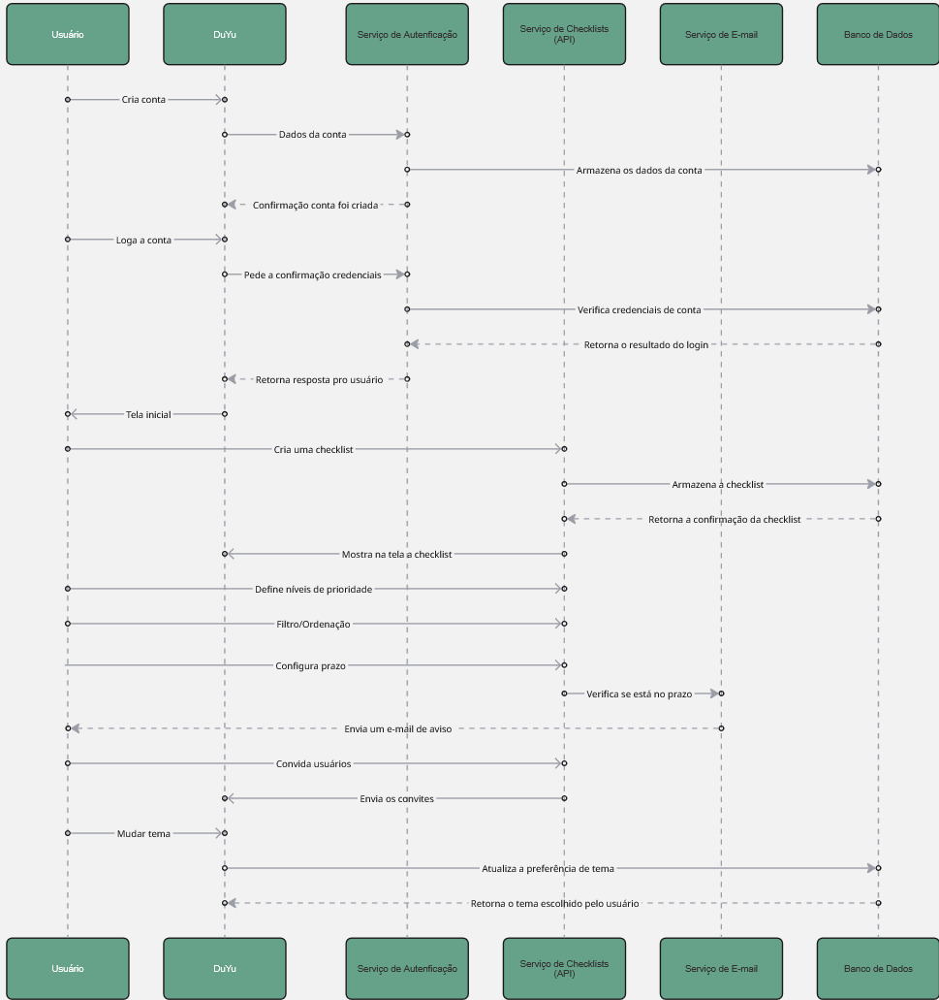
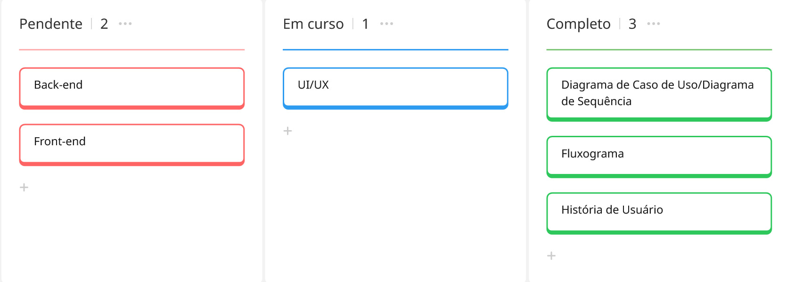
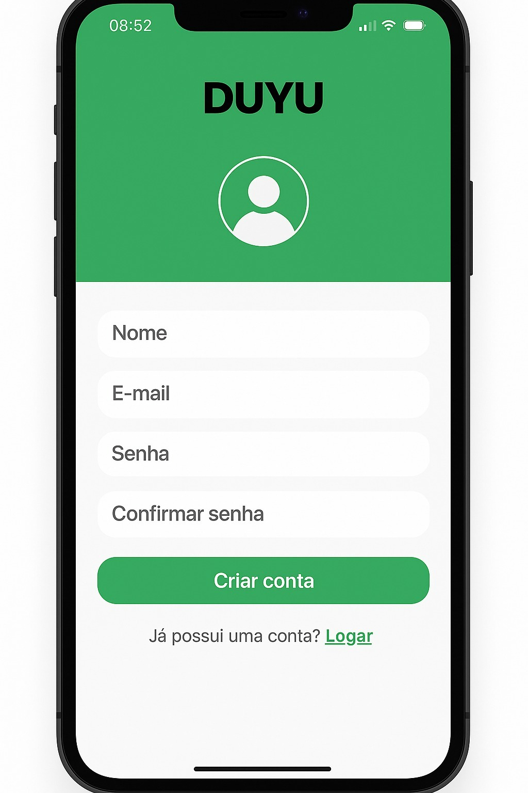
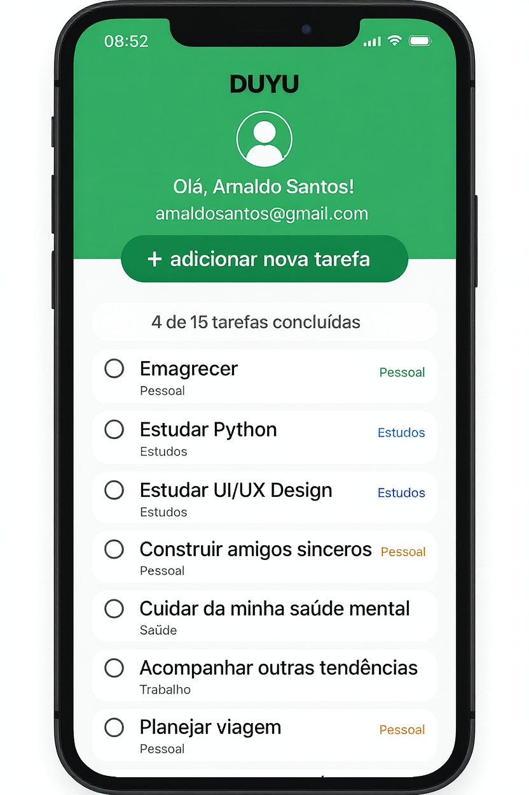

# DuYu — App de Checklist
O **DuYu** é um aplicativo de checklist simples e colaborativo para criar listas, priorizar atividades, receber lembretes e compartilhar com outras pessoas.

---

## Navegação rápida (docs)

- [→ Ir para a página do Fluxograma](docs/protótipos/fluxograma.md)
- [→ Ir para a página de Casos de Uso (UML)](docs/protótipos/casos-de-uso.md)
- [→ Ir para a página do Diagrama de Sequência (UML)](docs/protótipos/sequencia.md)
- [→ Ir para a página de Histórias de Usuário](docs/protótipos/historias-de-usuario.md)
- [→ Ir para o Backlog](docs/backlog.md)
  
---

## Objetivo do projeto
Entregar um app de checklist que permita organizar responsabilidades, priorizar o que é importante e não perder prazos.

---

## Funcionalidades do DuYu
- Criar e gerenciar múltiplas checklists.
- Autenticação: criar conta e fazer login.
- Temas (cores) para personalização.
- Dashboard em Kanban para acompanhar itens pendentes/em curso/concluídos.
- Prioridades (alta/média/baixa).
- Notificações por e-mail próximas ao prazo final.
- Compartilhamento de checklists (visualização/edição).
- Ordenação e filtros por status, prioridade e prazo.

##As histórias de usuário detalhadas estão em:  

---

## Modelagem e Fluxos
- Casos de Uso (UML): [`docs/protótipos/casos-de-uso.md`](docs/protótipos/casos-de-uso.md)  
  

- **Diagrama de Sequência (UML):** [`docs/protótipos/sequencia.md`](docs/protótipos/sequencia.md)  
  

- **Fluxograma do usuário:** [`docs/protótipos/fluxograma.md`](docs/protótipos/fluxograma.md)  
  

---

## Backlog
Planejamento por prioridades e etapas do projeto:  

---

## Telas do app (Figma)

---

## Visão técnica (proposta)
- Front-end: Web responsivo.
- API (REST): checklists, itens, convites, notificações.
- Banco de Dados: relacional.
- Serviço de E-mail: disparo de lembretes.
- Autenticação: serviço dedicado.

---

## Status
- ✅ Protótipos e documentação inicial
- ✅ UML (Casos de Uso e Sequência)
- ✅ Fluxograma
- ✅ Backlog
- ⏳ Implementação técnica (planejamento)
