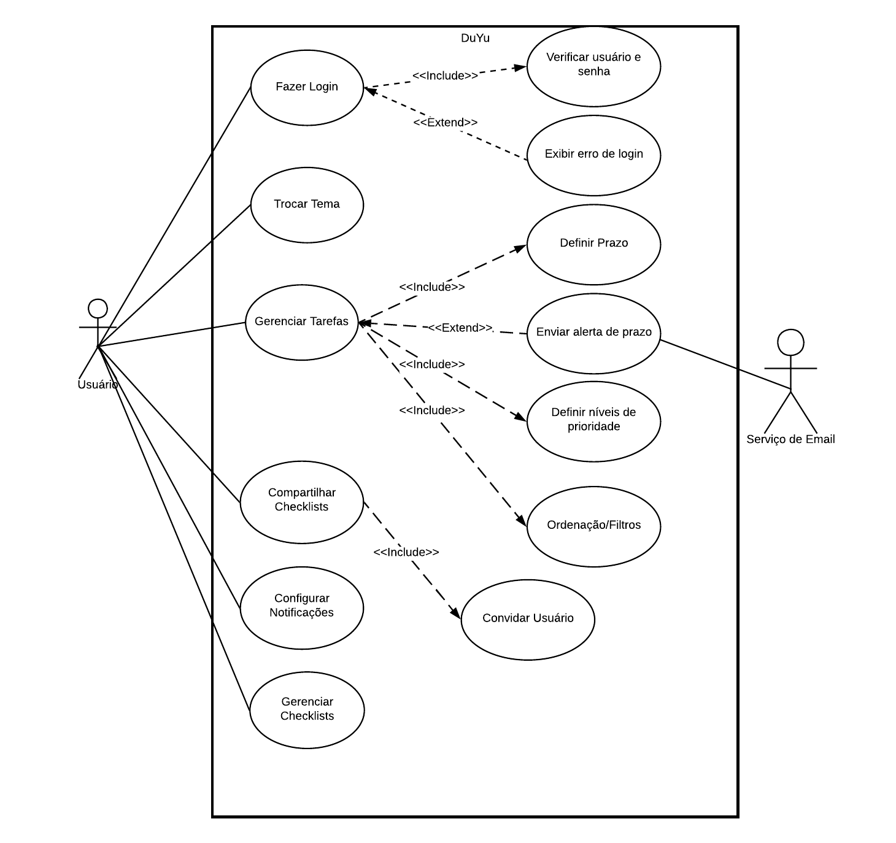

# DuYu — App de Checklist

Integrantes: Arthur S., Enzo M., Lowan T., Lucas S. e Manassés Z.
O **DuYu** é um aplicativo de checklist simples e colaborativo para criar listas, priorizar atividades, receber lembretes e compartilhar com outras pessoas.

---

## Planejamento do Projeto DuYu para Investidores-Anjo (5W2H e Cronograma de Entregas)

1. **Visão Geral do Projeto DuYu**
   O DuYu é um aplicativo web de checklist simples e colaborativo que permite:

   * Criar e gerenciar múltiplas listas de tarefas;
   * Priorizar atividades (alta/média/baixa);
   * Visualizar tarefas em Kanban (pendente / em andamento / concluído);
   * Receber notificações por e-mail próximas do prazo final;
   * Compartilhar checklists com outras pessoas (perfis de dono/editor/leitor);
   * Personalizar a experiência por meio de temas de cores.

   Time atual: Arthur S., Enzo M., Lowan T., Lucas S. e Manassés Z.

---

## 2. Planejamento 5W2H do DuYu

### 2.1 Tabela 5W2H

| 5W2H     | Pergunta                                     | Resposta para o DuYu                                                                                                                                                              |
| -------- | -------------------------------------------- | --------------------------------------------------------------------------------------------------------------------------------------------------------------------------------- |
| What     | O que será feito?                            | Desenvolvimento do DuYu, um app web de checklist colaborativo com Kanban, prioridades, notificações e compartilhamento.                                                           |
| Why      | Por que será feito?                          | Ajudar pessoas e equipes a organizar responsabilidades, evitar esquecer tarefas importantes e não perder prazos.                                                                  |
| Where    | Onde será feito e usado?                     | Desenvolvimento remoto pelo time (online), deploy em nuvem; uso via navegador (desktop e mobile).                                                                                 |
| When     | Quando será feito e quais marcos de entrega? | Ciclo previsto entre **6 e 10 meses** (mínimo 6 meses de desenvolvimento ativo, com possibilidade de se estender até 10 meses em caso de pendências), com entregas parciais.      |
| Who      | Quem está envolvido?                         | Time de 5 integrantes (devs, UI/UX, QA), professores, possíveis usuários-teste e investidores-anjo (Anjos do Brasil).                                                             |
| How      | Como será feito (método e tecnologia)?       | Desenvolvimento incremental (estilo ágil), backend + frontend separados, integração contínua, testes, monitoramento.                                                              |
| How much | Quanto vai custar (estimativa)?              | Investimento estimado em **R$ 150.000,00** para 6 a 10 meses (bolsas para o time, infraestrutura em nuvem, ferramentas e marketing inicial, com reserva para riscos/contingência). |

### 2.2 Detalhando cada ponto

#### What — O que será entregue?

* **Produto principal: Aplicativo web DuYu** com:

  * Cadastro/login de usuários;
  * CRUD de checklists e itens;
  * Kanban de atividades (pendente/em curso/concluído);
  * Prioridade por atividade (alta/média/baixa);
  * Notificações por e-mail próximas ao prazo final;
  * Compartilhamento de checklists com permissão de dono / editor / leitor;
  * Temas de cores;
  * Filtros e ordenações por status, prioridade e prazo.
* **Documentos:**

  * Casos de uso, diagramas de sequência, fluxograma do usuário (já iniciados);
  * Backlog priorizado;
  * Planejamento 5W2H;
  * Evidências de testes não funcionais (JMeter).

#### Why — Por que o DuYu existe?

* As pessoas têm várias responsabilidades (faculdade, trabalho, projetos, vida pessoal) e acabam:

  * Esquecendo prazos;
  * Perdendo o controle de tarefas;
  * Não conseguindo priorizar o que é mais importante.
* Ferramentas atuais ou são muito complexas ou não são colaborativas o suficiente.
* O DuYu busca ser:

  * Simples de usar;
  * Colaborativo;
  * Focado em **prioridade + prazos + notificações**.

#### Where — Onde será feito e utilizado?

* **Desenvolvimento:**

  * Equipe trabalhando de forma flexível (desenvolvimento remoto e presencial), coordenando tudo via GitHub, reuniões e ferramentas de comunicação (Discord/WhatsApp).
* **Uso:**

  * Acessado via navegador em desktop e dispositivos móveis (responsivo / PWA).

---

## 3. When — Cronograma

> **Prazo global do projeto:**
> * **Tempo mínimo:** 6 meses (se tudo for entregue conforme o cronograma base);
> * **Tempo máximo:** até 10 meses (cenário hipotético com atraso de algumas pendências).

### Etapa 1 — Kickoff, Alinhamento e Planejamento Detalhado

**Período:** 1 semana e meia
**Entregas:**

* Documento 5W2H finalizado e revisado;
* Backlog inicial no GitHub Projects (histórias de usuário e prioridades);
* Definição de papéis e responsabilidades por integrante;
* Ajuste do Figma.

---

### Etapa 2 — MVP Funcional (Autenticação + Checklists Básicas)

**Período:** 2 meses
**Entregas:**

* **Backend** com:

  * API de autenticação (criar conta, login, recuperação de senha);
  * API CRUD de checklists e itens;
* **Frontend** com:

  * Telas de login/cadastro;
  * Tela de listagem de checklists;
  * Tela de visualização/edição de checklist (lista simples, sem Kanban ainda);
* Banco de dados com regras mínimas para integridade (chaves, campos obrigatórios, etc.);
* Deploy inicial em ambiente de homologação (para testes internos da equipe).

---

### Etapa 3 — Dashboard Kanban + Prioridades + Temas

**Período:** 1 mês
**Entregas:**

* Kanban com colunas **Pendente / Em curso / Concluído**;
* Definição e implementação das prioridades (alta/média/baixa) com:

  * Ícones/símbolos + cores (respeitando acessibilidade);
* Suporte a escolha de **temas de cores** no app;
* Testes de usabilidade básicos com alguns usuários (colegas, amigos);
* Ajustes visuais com base no Figma.

---

### Etapa 4 — Compartilhamento de Checklists + Notificações por E-mail

**Período:** 1 mês
**Entregas:**

* **Módulo de compartilhamento:**

  * Dono pode convidar usuários;
  * Perfis: dono / editor / leitor;
* **Notificações por e-mail:**

  * Envio de lembretes próximos ao prazo final;
  * Configuração de SPF/DKIM (ao menos conceitual/descrita, se não for implementado de fato);
* Garantir:

  * Links de descadastro em todos os e-mails;
  * Evitar envios duplicados na mesma janela de tempo.

---

### Etapa 5 — Testes Não Funcionais, Monitoramento e Ajustes Finais

**Período:** 1 semana e meia
**Entregas:**

* Plano de testes não funcionais (desempenho, confiabilidade, segurança, etc.);
* Execução de testes com JMeter:

  * Cenários de carga;
  * Medição dos tempos;
* Logs e monitoramento:

  * Registro de ações relevantes (data/hora + usuário + ação);
  * Métricas de tempo de resposta e taxa de erros.

---

### Etapa 6 — Lançamento, Marketing Inicial e Suporte Assistido

**Período:** 1 mês
**Entregas:**

* Lançamento público controlado (beta aberta) do DuYu;
* Landing page do produto com foco em captação de usuários;
* Primeiras ações de marketing (divulgação em redes sociais, grupos acadêmicos e comunidades);
* Acompanhamento de métricas-chave (usuários ativos, listas criadas, engajamento);
* Coleta e registro de feedbacks dos usuários em backlog priorizado;
* Suporte assistido à operação (correção de bugs, pequenos ajustes de UX e melhorias rápidas).

---

## 4. Papéis, Especialidades e Responsabilidades

### 4.1 Quantas pessoas por especialidade

* Cenário real (time de 5 pessoas):

  * 2 pessoas com foco **backend**;
  * 2 pessoas com foco **frontend/UX**;
  * 1 pessoa com foco em **QA/DevOps/documentação**.

---

## 5. Estratégias para Manter a Equipe Motivada e Unida

Os investidores vão querer saber como vocês vão fazer o time **não desmontar no meio do projeto**:

1. **Reunião rápida semanal (ou 2x por semana):**

   * 15–20 minutos;
   * O que fiz desde a última reunião, o que vou fazer agora, bloqueios.

2. **Metas claras por sprint/entrega:**

   * Cada etapa do cronograma tem um conjunto pequeno de objetivos bem definidos.

3. **Reconhecimento interno:**

   * Celebrar entregas importantes (fechar MVP, subir deploy, rodar testes com sucesso);
   * Bônus por entrega;
   * Dar crédito em commits/issues e nas apresentações.

4. **Ambiente seguro pra errar e aprender:**

   * Problema = oportunidade de melhoria;
   * Programação em conjunto quando alguém estiver travado.

5. **Transparência com os investidores:**

   * Relatórios curtos de progresso;
   * Mostrar o que funcionou e o que não funcionou;
   * Ajustar escopo se algo estiver impossível no tempo.

6. **Divisão de tarefas equilibrada:**

   * Evitar sobrecarregar sempre a mesma pessoa;
   * Rotação de tarefas (todo mundo tem chance de aprender backend, frontend, testes).

---

## 6. Quanto vocês querem de dinheiro?

* **Total pedido:** **R$ 150.000,00** para um período entre **6 e 10 meses**.

### 6.1 Distribuição do investimento

* **R$ 110.000,00 — Bolsa/ajuda de custo para o time (5 pessoas)**

  * Distribuição **igualitária**:

    * R$ 110.000,00 ÷ 5 = **R$ 22.000,00 por pessoa** no total do projeto.
  * Em termos de valor mensal:
    * Cenário **mínimo (6 meses)**: cerca de **R$ 3.600,00/mês por pessoa**;
    * Cenário **máximo (10 meses)**: cerca de **R$ 2.200,00/mês por pessoa**.

* **R$ 10-15.000,00 — Infraestrutura:**

  * Hospedagem, banco de dados, e-mail transacional, domínio, ferramentas adicionais, monitoramento etc.

* **R$ 10.000,00 — Marketing e aquisição de usuários:**

  * Landing page, anúncios iniciais, material visual, identidade visual mínima.

* **R$ 10.000,00 — Reserva de risco/contingência:**

  * Ajustes de infraestrutura, aumento pontual de custos, necessidade de novas ferramentas, imprevistos.

## Navegação rápida (docs)

- [→ Ir para a página do Fluxograma](docs/protótipos/fluxograma.md)
- [→ Ir para a página de Casos de Uso (UML)](docs/protótipos/casos-de-uso.md)
- [→ Ir para a página dos Diagramas de Sequência (UML)](docs/protótipos/sequencia.md)
- [→ Ir para a página de Histórias de Usuário](docs/protótipos/historias-de-usuario.md)
- [→ Ir para a página de Requisitos Não Funcionais](docs/protótipos/requisitos.md)
- [→ Ir para o Backlog](docs/pictures/backlog.md)
  
---

## Objetivo do projeto
Entregar um app de checklist que permita organizar responsabilidades, priorizar o que é importante e não perder prazos.

---
## Funcionalidades do DuYu
- Criar e gerenciar múltiplas checklists.
- Autenticação: criar conta e fazer login.
- Temas (cores) para personalização.
- Dashboard em Kanban para acompanhar itens pendentes/em curso/concluídos.
- Prioridades (alta/média/baixa).
- Notificações por e-mail próximas ao prazo final.
- Compartilhamento de checklists (visualização/edição).
- Ordenação e filtros por status, prioridade e prazo.

## As histórias de usuário detalhadas estão em:  

---

## Requisitos não funcionais

* **Desempenho** — app abre em até **3s** (4G comum); criar/mover/editar item em **≤ 1s**; e-mails de prazo em **≤ 5 min**.
* **Confiabilidade** — disponibilidade mensal **≥ 99%**; **backup diário** por **30 dias**; se cair, volta em **≤ 1h**.
* **Segurança** — **HTTPS** em tudo; senhas com **hash** (bcrypt/Argon2); **limite de tentativas** no login; permissões **dono / editor / leitor**.
* **Privacidade (LGPD)** — **coletar só o necessário**; botões para **baixar dados** e **apagar conta** (em até **30 dias**); e-mails com **descadastro**.
* **Acessibilidade** — **bom contraste** e fontes legíveis; **navegação por teclado**; **não usar só cor** para prioridade.
* **Usabilidade** — criar a primeira checklist em **~1 min**; **mensagens de erro** claras; **desfazer** exclusões por **5s**.
* **Escalabilidade** — começar com **5.000 usuários/mês** e **100 simultâneos**; poder **subir mais instâncias**; crescer sem travar.
* **Compatibilidade** — navegadores recentes (**Chrome/Edge/Firefox/Safari**); layout **responsivo** desde **360px**; funciona com internet fraca (**cache simples**).
* **Monitoramento** — **logs** com data/hora e ação principal; **métricas** (tempo de resposta, taxa de erros); **alertas** quando piorar.
* **Qualidade e Manutenção** — **testes** dos fluxos principais (login, CRUD, Kanban, e-mail); **lint/format + review**; **deploy** sem cair e **rollback ≤ 10 min**.
* **E-mails e Notificações** — configurar **SPF/DKIM**; evitar **e-mails duplicados**; todo e-mail com **link de descadastro**.
* **Dados** — **regras no banco** para evitar dados quebrados; **histórico simples** (quem mudou o quê e quando); **logs** por **90 dias**.

## Método de Teste de Requisitos Não Funcionais 

* **Realizamos uma bateria de testes não funcionais utilizando o Apache JMeter para orquestrar e medir cenários de carga, desempenho, concorrência e comportamentos críticos do back-end e fluxos principais do produto. Todos os requisitos listados abaixo foram considerados no planejamento e testados adequadamente em ambiente de homologação, com registros de execução e evidências arquivadas.**

---

## Modelagem e Fluxos
- Casos de Uso (UML): [`docs/protótipos/casos-de-uso.md`](docs/protótipos/casos-de-uso.md)  
  

- **Diagrama de Sequência (UML):** [`docs/protótipos/sequencia.md`](docs/protótipos/sequencia.md)  
  
  
  
  
  
  

- **Fluxograma do usuário:** [`docs/protótipos/fluxograma.md`](docs/protótipos/fluxograma.md)  
  .jpg)
  .jpg)

---

## Backlog
Organização do projeto:

---
## WireFrame

---

## Telas do app (Figma)
Link: https://www.figma.com/make/S1HP6Y5hbNzYachz7UF8ov/Website-Design-for-DuYu?fullscreen=1

---
